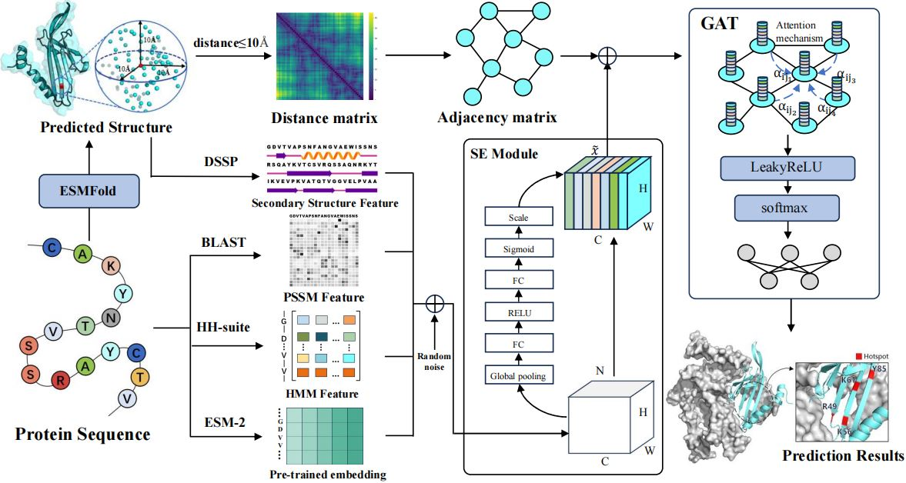

## Sequence-based Deep Learning Framework for Identifying Hotspot Residues in Protein-RNA Complexes

<p align="left">
  <a href="https://pytorch.org/">
    
  </a>
  <a href="https://www.dgl.ai/">
    
  </a>
  <a href="https://www.python.org/">
    
  </a>
</p>

## 📖 Table of Contents: 

- [Description](#-description)  <!-- 👉 原 #description → 需匹配标题中的 📝 -->
- [System and hardware requirements](#-system-and-hardware-requirements)
- [Software prerequisites](#-software-prerequisites)
- [Datasets](#-datasets)          <!-- 👉 原 #Datasets → GitHub自动转换大写字母为小写 -->
- [Feature](#-feature)            <!-- 👉 原 #Feature → 需添加连字符 -->
- [Environment Setup](#environment-setup)   <!-- 手动锚点方案 -->
- [Trained Models](#-trained-models) <!-- 👉 原 #The-trained-model → 需匹配标题复数形式 -->


## 📝 Description
In this study, we introduce DeepHotResi, a sequence-based computational method designed to predict hotspot residues in protein-RNA complexes. 

DeepHotResi leverages a pre-trained protein language model to predict protein structure and generate an amino acid contact map. To enhance feature representation, DeepHotResi integrates the Squeeze-and-Excitation (SE) module, which processes diverse amino acid-level features. 

Next, it constructs an amino acid feature network from the contact map and SE-Module-derived features. Finally, DeepHotResi employs a Graph Attention Network (GAT) to model hotspot residue prediction as a graph node classification task.

Experimental results demonstrate that DeepHotResi outperforms state-of-the-art methods, effectively identifying hotspot residues in protein RNA complexes with superior accuracy on the test set. 




## 🖥️ System Requirements
- ​**CPU**: Intel(R) Core(TM) i9-9900K CPU @ 3.60GHz 
- ​**GPU**: NVIDIA GPU (≥16GB VRAM) CUDA Version: 12.2 


## 📦 Software prerequisites 
The following is the list of required libraries and programs, as well as the version on which it was tested (in parenthesis).
* [Python](https://www.python.org/) (3.6)
* [ESM-2](https://github.com/facebookresearch/esm) . (esm2_t36_3B_UR50D)
* [BioPython](https://github.com/biopython/biopython) .
* [DSSP](https://github.com/cmbi/dssp) . (2.3.0)
* [DGL](https://www.dgl.ai/). (0.6.0). 
* [CD-HIT](https://github.com/weizhongli/cdhit/releases). (4.8.1) 
* [Pymol](https://pymol.org/2/). This optional plugin allows one to visualize surface files in PyMOL.
* [torch](https://pytorch.org/). (1.9.0) 
* [torch_geometric](https://pytorch.org/). (2.3.1) 
* [torchvision](https://pytorch.org/). (0.10.0+cu111) 
* pandas. (2.0.1) 

## 📊 Datasets

| FILE NAME            | DESCRIPTION                                                   |
|----------------------|---------------------------------------------------------------|
| data_dict.pkl        | Convert data to dictionary format.(['Protein Name', 'Sequence', 'Label'])                           |
| data_dict_test.pkl   | Same as above, but prepared for Test set.                           |
| protein_dict_test.pkl| 3D coordinate data of protein CA atoms                                                |


## ✨ Feature

| FEATURE NAME        | DESCRIPTION                                                       |
|---------------------|-------------------------------------------------------------------|
| DSSP                | Secondary structure and solvent accessibility annotation.        |
| ESM                 | Evolutionary context through deep learning embeddings.           |
| PSSM_npy            | Sequence homology and conservation via scoring matrices.         |
| Distance Matrices   | Spatial distances between residues for 3D structure insight.      |
| HMM                 | Statistical properties and functional sites of protein families. |

## 🛠️ Environment Setup
<a id="environment-setup"></a>  <!-- 显式锚点 -->
1. Clone the repository:  
   ```bash
   git clone https://github.com/Q1DT/DeepHotResi.git && cd DeepHotResi
2. Create the Conda environment from ``./model/environment.yml``
    ```bash
    conda env create -f environment.yml  
3. Activate the environment:
    ```bash
    conda activate hotspot

## 🎯 Trained Models

The models with trained parameters are put in the directory `` ./Model'``

## Usage
### ⚙ Network Architecture
Our model is implemented in ``DeepHotResi.py``.
You can run ``train.py`` to train the deep model from stratch and use the ``test.py`` to test the test datasets with the trained model.


**Model Training**

Run 
```
python train.py
``` 

**Model Testing**

Run 
```
python test.py
``` 
